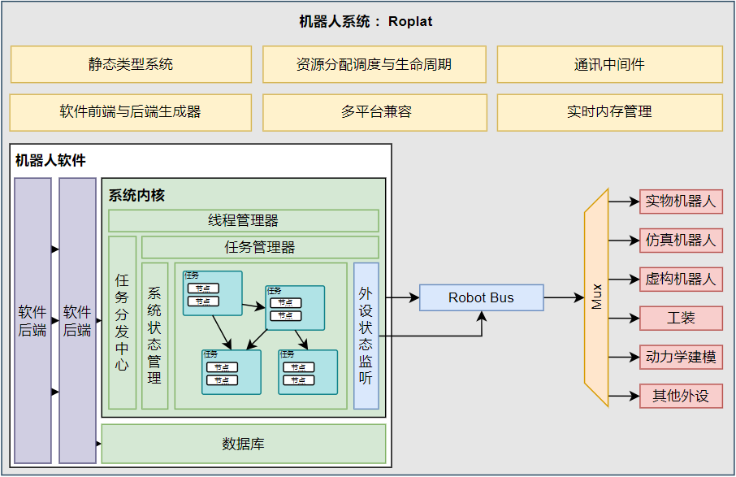

# Introduction

本项目是一个基于 Rust 的实验平台。我们希望将搭建多机器人实验环境的复杂步骤简化为节点的连接和配置，使得用户可以专注于实验的设计和实现。

  

## Why Rust?

实际上我们的工作与 matlab 中 simulink 很是相似，都是期望能够模块化的搭建一个实验平台。但是本系统采用 rust 出于以下几方面的考虑：

1. Rust 是一门系统级别的语言，其性能与 C 语言相当，得益于其零成本抽象，在部分情况下其性能甚至优于C++
2. Rust 在安全性上有着相当好的表现，这对于机器人实验平台来说，运行时的代码安全性直接关乎到实验设备的安全性。
3. Rust 的静态类型系统使得我们几乎可以实现编码完成=运行成功。而无需面对令人焦头烂额的运行时错误和漫长的debug过程。这点想必此前使用 C++/ros 的同学们深有体会。

总而言之我们一方面希望能够像 simulink 一样提供一个模块化的实验平台，另一方面我们也追求最优的运行时性能和代码安全性。Rust 无疑是最好的选择了。

至于 Rust 陡峭的学习曲线，我们在系统搭建的过程中已经尽量完成了其中较为复杂的部分，在具体的控制器和规划器的实现中，实际上更多的还是常见的矩阵乘法等数学运算，而无需担忧所有权、生命周期等令人头大的概念。剩余的这点难度，就当时本系统的小小门槛吧。

## ROS?

`ROS` 及 `ROS2` 是开源的机器人操作系统。但是其繁琐复杂的编译流程以及通讯过程中相当长的延迟已经为初学者带来了极高的门槛以及为机器人的实验和发展本身带来了诸多阻碍。我们不否认在过去的事件里 `ROS` 为机器人的发展做出了巨大的贡献，许许多多优秀的开源项目在此基础上实现，ROS 中也存在很多好用的包可供调用。但是是时候做出一些改变了。

当然，我们保留了 `ROS` 及 `ROS2` 的通讯接口，以便此前的项目可以无痛迁移而无需过多的修改。具体的调用方法见节点篇章。

## Multi-Robot?

在多机协同任务中，我们常常会遇到多个机械臂参与同一个节点的分析，也会有为一个节点设置多个任务的情况。`RoPlat` 通过节点和依赖管理来实现这样的需求，更加详细的内容请见系统架构篇章，简单来说，一个机器人可以被多个节点保管其所有权，但是其中只有两个节点具有**写权限**。

我们的系统希望能够支持多种不同类型的机械臂同时协作，这只需要合理的配置任务文件即可
