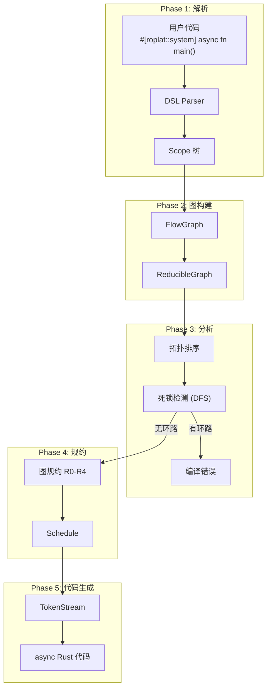

# 编译管线

`#[roplat::system]` 宏在编译期完成从 DSL 到可执行 async Rust 代码的全部转换。本文详解这一过程。

## 总览



## Phase 1: DSL 解析

`#[roplat::system]` 接收用户写的函数体，解析其中的特殊语法：

```rust
#[roplat::system]
async fn main() {
    let mut a = NodeA::new();
    let mut b = NodeB::new();
    let mut c = NodeC::new();

    timer >> {
        a >> b >> c;
    };
}
```

解析器识别以下结构：

| 语法 | 解析为 |
|:-----|:------|
| `let mut x = Expr;` | 节点声明（收集到顶层 scope） |
| `rhythm >> { ... }` | 节律域（ScopedGroup） |
| `a >> b` | 数据流边（FlowEdge） |
| `match / if` | 条件分支节点 |

产出：一棵 **Scope 树**，每个节律域是一个 scope，scope 内记录节点列表和边。

## Phase 2: 图构建

Scope 树被转换为 `FlowGraph`：

- 每个节点变成图中的顶点
- 每条 `>>` 变成有向边
- 跨 scope 的引用标记为**跨域边**

```text
FlowGraph {
    nodes: [a, b, c],
    edges: [(a→b), (b→c)],
    groups: [Group { rhythm: timer, nodes: [a, b, c] }]
}
```

然后包装为 `ReducibleGraph`，这是图规约算法的工作对象。

## Phase 3: 拓扑分析

### 依赖排序

对每个 scope 内的节点进行拓扑排序，确保执行顺序正确。

### 死锁检测

对跨域通道依赖进行 DFS 分析：

```text
Group 0 (timer_1khz): [sensor, ctrl]
Group 1 (timer_30hz): [camera, detect]

跨域边: ctrl → detect (Group 0 → Group 1)
         detect → ctrl (Group 1 → Group 0)  ← 构成环路！

error: 检测到跨组死锁环路: [group_0] → [group_1] → [group_0]
```

环路检测在**编译期**完成——不存在运行时死锁的可能。

## Phase 4: 图规约

核心算法反复应用 R0-R4 规则，将图化简为单个调度节点：

### R0: 单节点规则

```text
[A] → A.process(input).await
```

### R1: 串行融合

```text
A → B → C
    ↓
SeqNode([A, B, C])

生成:
  let o1 = a.process(input).await;
  let o2 = b.process(o1).await;
  c.process(o2).await;
```

### R2: 并行融合

```text
    ┌→ B
A ──┤
    └→ C

    ↓
ParNode(A, [B, C])

生成:
  let out = a.process(input).await;
  let (rb, rc) = tokio::join!(
      b.process(out.clone()),
      c.process(out),
  );
```

### R3: 拓扑排序

对无法直接融合的复杂图，按拓扑序排列，然后递归应用 R1/R2。

### R4: 通道切割

跨域边被替换为 channel Tx/Rx：

```text
Group 0: [..., A]  →  Group 1: [B, ...]
         跨域边 A→B

    ↓

Group 0: [..., A, Tx]    // A 的输出写入 channel
Group 1: [Rx, B, ...]    // B 从 channel 读取
```

通道类型根据拓扑自动选择：

- 1:N 扇出 → triple buffer (SPMC)
- 1:1 队列 → ring buffer (SPSC)

## Phase 5: 代码生成

规约完成后，`Schedule` 被展开为 `TokenStream`——完全确定的、无动态调度的 async Rust 代码。

最终生成的代码等价于手写的 `async fn`，没有 `dyn`、没有 `Box`、没有运行时调度器。

## 优化效果

| 指标 | 传统方案（如 ROS 2） | Roplat |
|:-----|:-----|:------|
| 每 tick 调度开销 | ~10μs（executor 查找 + 虚调用） | ~0ns（内联 await 链） |
| 堆分配 | 每消息 1+ 次 | 0 次 |
| 类型检查 | 运行时反序列化 | 编译期 |
| 死锁发现 | 部署后才暴露 | `cargo build` |

---

返回 [架构参考总览](00%20Overview.md)
