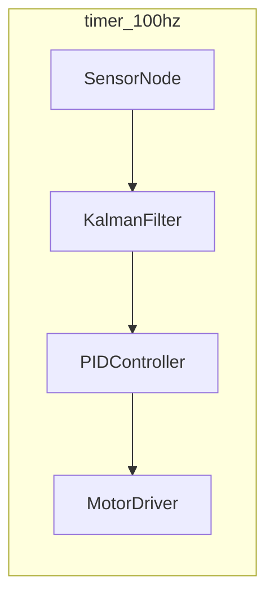

# cargo-roplat CLI

`cargo-roplat` 是 Roplat 的命令行工具，提供代码生成、系统运行和拓扑可视化功能。

## 安装

```powershell
# 从源码安装（workspace 内）
cargo install --path cargo-roplat

# 安装后作为 cargo 子命令使用
cargo roplat --help
```

## 子命令

### generate — 代码生成

从 YAML 架构文件生成 Rust 代码：

```powershell
cargo roplat generate arch.yaml
cargo roplat generate arch.yaml --output src/generated.rs
```

### run — 编译并运行

编译 YAML 描述的系统并运行：

```powershell
cargo roplat run arch.yaml
```

### topology — 拓扑可视化

生成系统拓扑图：

```powershell
# Mermaid 格式（可直接嵌入 Markdown）
cargo roplat topology arch.yaml --format mermaid -o topology.md

# DOT 格式（Graphviz）
cargo roplat topology arch.yaml --format dot -o topology.dot

# 从 DOT 生成图片
dot -Tpng topology.dot -o topology.png
```

Mermaid 输出示例：



## YAML 架构文件格式

```yaml
# 节律源定义
rhythms:
  - id: control_timer
    type: SysTimer
    interval_ms: 10         # 100Hz

  - id: vision_timer
    type: SysTimer
    interval_ms: 33          # ~30Hz

# 节点定义
nodes:
  - id: sensor
    type: SensorNode
  - id: filter
    type: KalmanFilter
  - id: controller
    type: PIDController
    params:
      kp: 2.0
      ki: 0.1
      kd: 0.05
  - id: motor
    type: MotorDriver

# 连接（数据流）
connections:
  - from: sensor
    to: filter
  - from: filter
    to: controller
  - from: controller
    to: motor

# 节律域分组
groups:
  - rhythm: control_timer
    nodes: [sensor, filter, controller, motor]
```

## 与 System DSL 的关系

YAML 文件和 System DSL 是等价的两种描述方式：

| 方面 | System DSL (`>>`) | YAML 文件 |
|:-----|:----------|:---------|
| 定义方式 | Rust 代码内 | 外部文件 |
| 编辑工具 | IDE + Rust 分析 | 任何文本编辑器 |
| 类型检查 | 编译期 | 生成代码后编译期 |
| 适用场景 | 小型系统、原型 | 大型系统、运维调整 |

两者可以混合使用：

```rust
#[roplat::system(file = "arch.yaml")]
async fn main() {
    // YAML 拓扑自动注入
    // 可以在此追加 DSL 代码
}
```

---

返回 [架构参考总览](00%20Overview.md)
