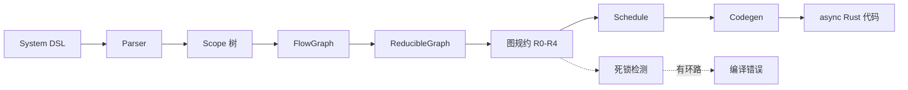

# System — 声明式编排

System 是 Roplat 的最高层抽象——它将 Node 和 Rhythm 组装为一个可运行的系统，并在**编译期**完成拓扑分析、死锁检测和代码生成。

## System DSL

使用 `#[roplat::system]` 宏标注一个 `async fn`，在函数体内使用 `>>` 操作符声明数据流：

```rust
#[roplat::system]
async fn main() {
    // 1. 实例化节点（顶层作用域）
    let mut sensor = SensorNode::new();
    let mut filter = KalmanFilter::new();
    let mut ctrl   = PIDController::new();
    let mut motor  = MotorDriver::new();
    let mut logger = LogNode::new();

    // 2. 声明数据流（嵌套作用域）
    timer_100hz >> {
        sensor >> filter >> ctrl >> motor;
        sensor >> logger;
    };
}
```

### 语法规则

| 语法 | 含义 |
|:-----|:-----|
| `a >> b` | a 的输出作为 b 的输入 |
| `rhythm >> { ... }` | 节律源驱动作用域内的节点组 |
| `{ a; b; }` | 顺序执行 a 然后 b |
| `a >> b; a >> c;` | a 的输出同时扇出到 b 和 c（并行） |

### 分号语义与 Feed 类型

Roplat 利用 Rust 的**语句/表达式**区分来决定节律域的 `Feed` 值：

| 写法 | Rust 语义 | 效果 |
|:-----|:----------|:-----|
| `a >> b;` | 语句（有分号） | 输出被丢弃，Feed = `()` |
| `a >> b` | 表达式（无分号） | 最后一个节点的输出作为 Feed 返回给节律源 |

这与 Rust 函数体中最后一行有无分号决定返回值的语义完全一致。

**示例 — Feed = ()**

当节律源不需要节点反馈时（如 `SysTimer`，其 `Feed = ()`），在链末尾加分号：

```rust
timer >> {
    space_mouse >> mapper;  // ; → Feed = ()，输出被丢弃
};
```

**示例 — Feed = 节点输出**

当节律源需要节点反馈时（如 `ArmMotionRhythm`，其 `Feed = (MotionType, bool)`），省略最后一条链的分号：

```rust
control_rhythm >> |state| {
    state >> position_node  // 无 ; → 表达式，输出作为 Feed 返回
};
```

闭包形式 `|state|` 中同样适用——块内最后一条链有无分号决定 Feed 类型。

!!! tip "何时加分号"
    查看节律源的 `type Feed`：如果是 `()`，所有链都加 `;`；如果是具体类型，确保最后一条链不加 `;`。类型不匹配会产生编译错误。

### 并行与顺序

作用域内互不依赖的分支自动并行：

```rust
timer >> {
    // A 和 B 互不依赖 → tokio::join! 并行执行
    source >> node_a >> sink_a;
    source >> node_b >> sink_b;
};
```

生成的代码等价于：

```rust
let source_out = source.process(event).await;
let (_, _) = tokio::join!(
    async { node_a.process(source_out.clone()).await; sink_a.process(...).await; },
    async { node_b.process(source_out).await; sink_b.process(...).await; },
);
```

### 控制流

system DSL 支持 `match` 和 `if` 表达式，用于条件执行：

```rust
timer >> {
    sensor >> detector;

    match detector.result() {
        Some(obj) => obj >> tracker >> planner,
        None => () >> idle_node,
    };
};
```

控制流分支在图规约中被视为"超级节点"，保证拓扑排序的正确性。

## 编译期管线

`#[roplat::system]` 宏触发以下编译期处理：



### 图规约规则

| 规则 | 名称 | 作用 |
|:-----|:-----|:-----|
| **R0** | 单节点 | 基础情况：直接 `.process().await` |
| **R1** | 串行融合 | `A → B` → 顺序 await 链 |
| **R2** | 并行融合 | `A → (B ∥ C)` → `tokio::join!` |
| **R3** | 拓扑排序 | 对复杂图进行拓扑排序，保证依赖顺序 |
| **R4** | 通道切割 | 跨节律域的边 → 自动插入 channel Tx/Rx |

规约反复应用直到整个图化简为单个调度节点。最终产物是完全展开的、无动态调度的 `async` 代码。

### 死锁检测

编译期对跨节律域的通道依赖进行 DFS 分析。如果检测到环路（A 域等待 B 域的通道、B 域又等待 A 域的通道），立即产生编译错误：

```text
error: 检测到跨组死锁环路: [group_0] → [group_1] → [group_0]
  涉及通道: ch_1 (group_0 → group_1), ch_2 (group_1 → group_0)
```

### 错误人性化

system DSL 中的语法错误会产出带源码位置的中文错误信息：

```text
error: 未知的节律驱动语法，期望 `rhythm >> { ... }` 形式
  --> src/main.rs:15:5
   |
15 |     timer << { node_a >> node_b; };
   |     ^^^^^
```

## YAML 文件启动

除了在代码中直接写 DSL，还可以用 YAML 文件描述架构：

```yaml
# arch.yaml
rhythms:
  - id: control_timer
    type: SysTimer
    interval_ms: 10

nodes:
  - id: sensor
    type: SensorNode
  - id: controller
    type: PIDController
  - id: motor
    type: MotorDriver

connections:
  - from: sensor
    to: controller
  - from: controller
    to: motor

groups:
  - rhythm: control_timer
    nodes: [sensor, controller, motor]
```

```rust
#[roplat::system(file = "arch.yaml")]
async fn main() {
    // YAML 中声明的拓扑会被宏自动注入
}
```

## cargo roplat 工具链

CLI 工具提供代码生成和可视化功能：

```powershell
# 从 YAML 生成 Rust 代码
cargo roplat generate arch.yaml

# 编译并运行
cargo roplat run arch.yaml

# 生成拓扑图（Mermaid 或 DOT 格式）
cargo roplat topology arch.yaml --format mermaid -o topology.md
cargo roplat topology arch.yaml --format dot -o topology.dot
```

## 多节律域系统

一个系统中可以有多个节律域同时运行：

```rust
#[roplat::system]
async fn robot() {
    let mut imu    = IMU::new();
    let mut ctrl   = Controller::new();
    let mut camera = Camera::new();
    let mut detect = Detector::new();
    let mut plan   = Planner::new();

    // 高频控制域 — 闭包接收 state，最后一条链无分号 → Feed 返回
    timer_1khz >> |state| {
        state >> imu >> ctrl  // Feed = ctrl 的输出
    };

    // 中频规划域 — Feed = ()
    timer_100hz >> {
        plan;  // 分号 → Feed = ()
    };

    // 低频感知域 — Feed = ()
    timer_30hz >> {
        camera >> detect;  // 分号 → Feed = ()
    };
}
    };

    // 低频感知域
    timer_30hz >> {
        camera >> detect;
    };
}
```

域之间通过旁路通讯交换数据。编译期会在跨域边界自动插入 channel（R4 规则），并对 channel 依赖进行死锁分析。

## 设计要点

1. **代码即拓扑** — `>>` 的写法直接映射为执行结构，所见即所得
2. **编译期确定** — 不存在运行时"发现节点"或"协商拓扑"的过程
3. **图规约保证最优** — 自动发现并行机会，无需手动编排 `tokio::join!`
4. **错误前移** — 类型不匹配、死锁环路、语法错误全部在 `cargo build` 阶段报告

## 下一步

- [通讯模型](04%20Comm.md) — 主流通讯与旁路通讯的设计
- [快速开始](../QuickStart/00%20快速开始总览.md) — 动手创建第一个系统
