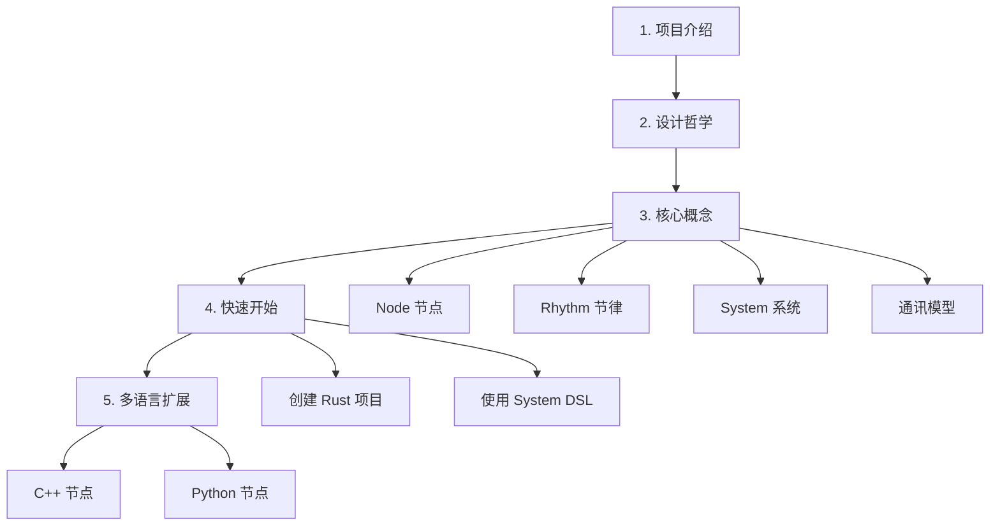

# 新手学习路线

本文面向完全不了解 Roplat 的新人。目标是让你在最短路径内，建立正确的心智模型并跑通第一个系统。

## 前置要求

```powershell
rustc --version   # nightly 工具链
cargo --version
git --version
```

如果还没有 Rust 环境，请先安装 [rustup](https://rustup.rs/) 并切换到 nightly：

```powershell
rustup default nightly
```

## 推荐学习路径



### 第一阶段：建立心智模型（30 分钟）

1. 阅读 [项目介绍](01%20Introduction.md) — 了解 Roplat 解决什么问题
2. 阅读 [设计哲学](02%20Design.md) — 理解"为什么这样做"

### 第二阶段：理解核心概念（1 小时）

按顺序阅读：

1. [Node 节点](../Concepts/01%20Node.md) — 最小计算单元
2. [Rhythm 节律](../Concepts/02%20Rhythm.md) — 时间驱动机制
3. [System 系统](../Concepts/03%20System.md) — 声明式编排 DSL
4. [通讯模型](../Concepts/04%20Comm.md) — 旁路通讯原语

!!! tip "关键心智模型"
    **Node 是"做什么"，Rhythm 是"什么时候做"，System 是"谁和谁连"。**

    三者完全正交——修改任意一个维度不影响另外两个。

### 第三阶段：动手实践（1 小时）

1. [快速开始总览](../QuickStart/00%20快速开始总览.md) — 环境准备
2. [从零创建 Rust 项目](../QuickStart/01%20从零创建%20Rust%20项目.md) — 第一个可运行系统

### 第四阶段：多语言扩展（可选）

1. [扩展 C++ 节点](../QuickStart/02%20扩展%20C++%20节点.md)
2. [扩展 Python 节点](../QuickStart/03%20扩展%20Python%20节点.md)
3. [实现数据互通](../QuickStart/04%20实现数据互通.md)

## 常见误区

### 误区 1："编译期约束 = 完全静态系统"

Roplat 追求"进程内静态 + 进程级动态"。单个进程内的拓扑是编译期确定的，但：

- 参数可以从 YAML 文件运行时加载
- 多个进程可以通过旁路通讯动态组合
- YAML 架构文件允许声明灵活的系统配置

### 误区 2："必须用 Rust 写所有节点"

完全不需要。Roplat 的多语言支持是一等公民：

- C++ 节点通过 FFI 直接调用，零拷贝
- Python 节点通过 PyO3 桥接，适合快速原型
- 三种语言的节点可以在同一个 system 中混合使用

### 误区 3："先学会所有权和生命周期才能用 Roplat"

作为 Roplat 的**用户**，你写的节点代码主要是常规的数据处理（矩阵运算、控制算法、信号处理等）。复杂的所有权和生命周期管理已经被框架封装好了。

### 误区 4："system! 宏很神秘"

`>>` 操作符只是数据流方向的声明——它会被编译为普通的 `.process().await` 调用。没有魔法，只是代码生成。你可以用 `cargo expand` 查看展开后的代码。

## 下一步

直接进入 [Node 节点](../Concepts/01%20Node.md) 开始学习核心概念。
