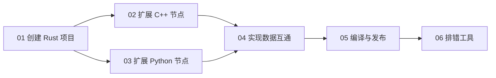

# 快速开始总览

本部分带你从零开始，创建一个完整的 Roplat 项目——从纯 Rust 节点开始，逐步扩展到 C++ / Python 多语言节点。

## 环境准备

### 必需

```powershell
# Rust nightly 工具链
rustup default nightly
rustc --version    # 需要 1.75+ (支持 async fn in traits)
cargo --version

# Git
git --version
```

### 可选（多语言扩展需要）

```powershell
# C++ 编译器（Windows: MSVC, Linux: GCC/Clang）
cl.exe /?          # Windows MSVC
g++ --version      # Linux

# Python 3.8+（Python 节点需要）
python --version

# CMake（使用 cmake 后端时需要）
cmake --version
```

## 章节路线



| 章节 | 内容 | 前置要求 |
|:-----|:-----|:---------|
| [01 创建 Rust 项目](01%20从零创建%20Rust%20项目.md) | 消息定义、节点实现、旁路通讯、System DSL | Rust nightly |
| [02 扩展 C++ 节点](02%20扩展%20C++%20节点.md) | 傀儡节点、build.rs、FFI 桥接 | + C++ 编译器 |
| [03 扩展 Python 节点](03%20扩展%20Python%20节点.md) | PyO3 桥接、Python 节点定义 | + Python 3.8+ |
| [04 实现数据互通](04%20实现数据互通.md) | 透明/不透明类型、跨语言通讯 | 完成 02 或 03 |
| [05 编译与发布](05%20编译与发布使用.md) | 构建命令、后端切换、质量门禁 | — |
| [06 排错工具](06%20路径排错实验库.md) | docs_path_lab 实验库 | — |

## 最小可运行示例

如果你想在 5 分钟内看到效果，可以直接运行仓库中的示例：

```powershell
git clone <roplat-repo-url>
cd roplat

# 运行最简单的示例
cargo run -p hello

# 运行 system 宏示例
cargo run --example hello_world -p macros

# 运行多语言示例
cargo run -p multi_lang --example rs_cpp
```

然后跟随 [01 创建 Rust 项目](01%20从零创建%20Rust%20项目.md) 从头开始自己创建。
