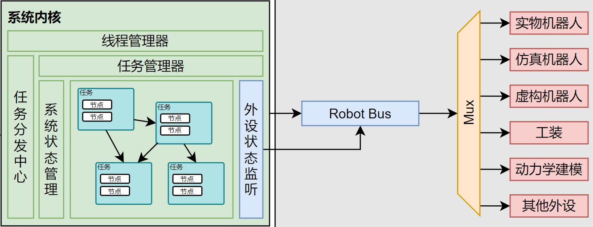

# 内核架构

简单了解一下内核是怎么工作的吧。

## 1. 内核指令

内核接受两个 `json` 文件并执行，一个是 `config.json` 一个是 `task.json`。其中 `config.json` 是配置文件，`task.json` 是任务文件。

`config.json` 主要留存一些配置和可供调用的资源信息，一般来说主要包括机器人和传感器的配置信息。
`task.json` 主要是任务文件，里面包含了任务的执行流程。任务文件中以 `task` 为单位，每个 `task` 中可能有多个节点，每个节点中包含了节点的类型和参数。

一个简单的案例如下，下方的配置文件中包含了两个机器人和一个障碍物发布器作为传感器。任务文件中包含了三个 `task`, 分别代表 `bullet` 引擎，障碍物发布器和一组机器人的轨迹跟踪规划-控制器（`cfs`, `interp`, `position`）。

```json
\\ task.json
{
  "robots": [
    { "name": "panda_1", "robot_type": "panda", "base_pose": { "rotation": [1.0, 0.0, 0.0, 0.0], "translation": [0.0, 0.0, 0.0] } },
    { "name": "panda_2", "robot_type": "panda", "base_pose": { "rotation": [1.0, 0.0, 0.0, 0.0], "translation": [0.0, 1.0, 0.0] } }
  ],
  "sensors": [
    {
      "name": "obstacle_list_1",
      "sensor_type": "obstacle_list",
      "params": [{ "Sphere": { "id": 1, "pose": { "rotation": [1, 0, 0, 0], "translation": [0, 0, 0] }, "params": 0.1 } }]
    }
  ]
}
```

```json
\\ task.json
[
  {
    "id": 0,
    "rely": [],
    "target": [],
    "nodes": [["bullet", ["panda_1", "panda_2"], ["obstacle_list_1"], { "period": 0.0, "config_path": "./config/config.json" }]],
    "edges": [[1, 0]]
  },
  {
    "id": 1,
    "rely": [],
    "target": [
      { "Transform": [1, { "rotation": [1, 0, 0, 0], "translation": [-1, 2, 1] }, { "rotation": [1, 0, 0, 0], "translation": [0.5, 1, 0.5] }] }
    ],
    "nodes": [["obstacle_releaser", [], ["obstacle_list_1"], { "period": 0.1, "interp": 10 }]],
    "edges": [[0, 1]]
  },
  {
    "id": 2,
    "rely": [0],
    "target": [
      { "Joint": [[0.0124, -0.8838, 0.3749, -2.2172, 0.232, 1.7924, 1.3719], 7, null] },
      { "Joint": [[0.2896, -1.0286, 0.6738, -2.0833, 0.551, 2.1874, 1.0705], 7, null] },
      { "Joint": [[0.0592, -0.3941, 0.4692, -1.6001, 0.1456, 2.0968, 1.201], 7, null] },
      { "Joint": [[0.1, -0.8292, 0.7548, -2.3791, 0.1615, 2.2308, 1.4292], 7, null] },
    ],
    "nodes": [
      ["cfs", ["panda_1"], ["obstacle_list_1"], { "period": 0.95, "ninterp": 7, "niter": 100, "cost_weight": [0, 10.0, 20.0], "solver": "osqp" }],
      ["interp", ["panda_1"], ["obstacle_list_1"], { "period": 0.1, "interp_fn": "lerp", "ninter": 25 }],
      ["position", ["panda_1"], [], { "period": 0.004 }]
    ],
    "edges": [
      [0, 1],
      [1, 2],
      [2, 3],
      [3, 0]
    ]
  }
]
```

## 2. 内核架构

又要端出经典的图了，内核的架构如下：

  

有人可能会问，“主播主播你的总线怎么在内核外面呢？”
别问，问就是还没实现。当前版本的内核中，连接外设的方法还是通过将外设驱动作为 `task` 的一个节点来实现的。比如可以发布如下的任务包，在 example_planner 中发布任务并由 panda_plant 和 gripper_plant 来执行。

```json
[
  {
    "id": 2,
    "rely": [],
    "target": [],
    "nodes": [
      ["example_planner", ["panda_1","gripper_1"], [], { "period": 1.0 }],
      ["panda_plant", ["panda_1"] , [], { "period": 0.001, "ip": "172.16.0.2", "control_mode": "joint", "is_realtime": false }],
      ["gripper_plant", ["gripper_1"], [], { "period": 0.001, "ip": "172.16.0.2" }]
    ],
    "edges": [
      [0, 1],
      [0, 2]
    ]
  }
]
```

所以，内核的调用方法就是选择对应的节点并且写出任务文件，然后丢给内核灰溜溜的执行。节点的运行由线程管理器和任务管理器承载，无需用户关心。

但是想要的节点内核里没有现成的怎么办？就需要我们去实现新节点。

## 3. 实现新节点

非常可惜，目前连接器还没有施工完成，你不能在内核包体外实现新节点。但是你当然可以在内核包体内实现新节点。:D

所有的节点都是 `Node` 结构体的泛型实现。通过特征 `NodeBheavior` 来实现节点的行为。并被调用。

结构体的泛型实现可能让人一头雾水，我们给出具体的形式。

Node 节点的完整形式是

```rust
pub struct Node<S, P, R, V>
where
    S: Default,
    P: DeserializeOwned,
{
    pub(crate) name: String,
    pub(crate) node_state: NodeState,
    pub(crate) is_end: bool,
    pub(crate) input_queue: NodeMessageQueue<V>,
    pub(crate) output_queue: NodeMessageQueue<V>,

    pub state: S,
    pub params: P,
    pub robot: R,
    pub sensor: Option<Arc<RwLock<Sensor>>>,
}
```

其中 `S` 是节点的状态，`P` 是节点的参数，`R` 是节点的机器人，`V` 是节点的消息类型。

在实际使用过程中我们无需再描述这个节点的完整形式，而是给每个节点赋予其特殊的 State 、Params 、Robot 和 Message 类型。

举例说明，一个单自由度 PID 控制器节点就可以被写成如下的形式：

```rust
pub type Pid<R, V, M> = Node<PidState, PidParams, (), f64>;

pub struct PidState { target: f64, last_error: f64, integral: f64 ,derivative: f64}
pub struct PidParams { kp: f64, ki: f64, kd: f64 }
```

我们为什么要分离 state 和 param 呢？实际上这是来自于节点内参数在运行时是否可变来区分的，可变的参数被认为是状态，被放在 state 中，要求被实现 `Default` 特征。不可变的参数被认为是参数，被放在 params 中，要求被实现 `DeserializeOwned` 特征。

综上，一个极简的节点实现如下（在内核包体内位于 `src/node/src/example/example_node.rs`）：

```rust
use message::NodeMessage;
use serde::Deserialize;

use crate::{Node, NodeBehavior};

type ExNode = Node<ExNodeState, ExNodeParams, (), f64>;

#[derive(Default)]
struct ExNodeState {
    target: f64,
    error: f64,
    integral: f64,
    derivative: f64,
}

#[derive(Deserialize)]
struct ExNodeParams {
    period: f64,
    kp: f64,
    ki: f64,
    kd: f64,
}

impl NodeBehavior for ExNode {
    fn update(&mut self) {
        if let Some(NodeMessage::Joint(target)) = self.input_queue.pop() {
            self.state.target = target;
        }

        let new_error = self.state.target;
        self.state.integral += new_error * self.params.period;
        self.state.derivative = (new_error - self.state.error) / self.params.period;
        self.state.error = new_error;

        let output = self.params.kp * self.state.error
            + self.params.ki * self.state.integral
            + self.params.kd * self.state.derivative;

        let control_message = NodeMessage::Joint(output);
        self.output_queue.push(control_message);
    }
}
```

如此一来，这个节点就可以被调用了，吗？
还差最后一步，你需要为其注册，这样内核才能找到它。（连接器还没实现，实现之后会自行注册）
你需要前往 `src/node/src/create.rs` 中注册这个节点, 仿照已有的节点注册方式即可。

```rust
pub fn create_node(node_type: &str, robot_name: String, params: Value) -> Box<dyn NodeExtBehavior> {
    let name = format!("{}:{}", node_type, robot_name);
    match node_type {
        "example_planner" => Box::new(ExPlanner::from_params(name, params)),
        "interp" => Box::new(Interp::from_params(name, params)),
        "cfs" => Box::new(Cfs::from_params(name, params)),

        "example_controller" => Box::new(ExController::from_params(name, params)),
        "impedence" => Box::new(DImpedence::from_params(name, params)),
        "impedence_diag" => Box::new(DImpedenceDiag::from_params(name, params)),
        "pid" => Box::new(DPid::from_params(name, params)),
        "position" => Box::new(DPosition::from_params(name, params)),

        "bullet" => Box::new(DBullet::from_params(name, params)),
        "obstacle_releaser" => Box::new(ObstacleReleaser::from_params(name, params)),

        "zmq_comm" => Box::new(ZmqComm::from_params(name, params)),

        "panda_plant" => Box::new(DPandaPlant::from_params(name, params)),
        "gripper_plant" => Box::new(GripperPlant::from_params(name, params)),
        // Add your node here
        _ => panic!("Unknown node type: {}", node_type),
    }
}
```

恭喜你，你完成了人生中第一个节点喵！

## 4. 深入线程，节点是怎么运行的

所有实现了 `NodeBehavior` 特征的节点都可以被放在节点管理器中，顺便一提，内核主线程也实现了这个特征，这意味着其实你可以吧内核线程放进内核线程管理器中去（不可以，你不能吧一个东西的所有权给他的子部分）。

节点运行的过程实际上参考了 `Arduino`  的入口函数，在 `NodeBehavior` 中，你可以实现以下函数

```rust
pub trait NodeBehavior: Send + Sync {
    fn init(&mut self) {}
    fn start(&mut self) {}
    fn update(&mut self) {}
    fn finalize(&mut self) {}

    fn state(&mut self) -> NodeState { NodeState::Running }
    fn period(&self) -> Duration { Duration::from_secs(0) }
    fn node_name(&self) -> String { String::from("unnamed_node") }
    fn node_type(&self) -> String { String::from("unnamed_type") }
}

线程管理器会按照以下方法调用这些函数

```rust
println!("{} 向您问好. {} says hello.", node.name, node.name);

node.init();

let period = node.period();
while node.state() != node::NodeState::Finished {
    let start_time = Instant::now();
    
    node.update();

    let elapsed_time = start_time.elapsed();
    if period > elapsed_time {
        thread::sleep(period - elapsed_time);
    }
}

node.finalize();
```

在实际的实现中还有许多标志位的判断和写入，这里暂且按下不表。
简单来说就是，节点执行的流程是 `init` ->  `update` -> `finalize`，其中 `update` 是节点的主要执行函数，可以持续循环，直到结束运行。

## 5. 任务依赖

很多时候我们需要我们的任务能够顺序执行并且满足某种依赖关系，你可以使用 `task.json` 中的 `rely` 字段说明，此时该任务会等待 `rely` 中的任务完成后再执行。但是很显然的时，所有的任务将组成一个有向无环图（有环图中需要添加设定：节点不死）。此时我们需要找到当前整张图中入度为 0 的节点，将其放入线程管理器中执行，然后将其后继节点的入度减一，直到所有节点都被执行。

这件事情是由任务管理器执行的，任务管理器用哈希表维护邻接表、入度表、开放任务列表，每次执行任务时，将任务放入线程管理器中，然后将其后继节点的入度减一，如果后继节点的入度为 0 则将其放入开放任务列表中。

## 6. 通信结构

节点间通讯暂时采用了无锁多线程的 `crossbeam::queue::SegQueue` 来作为消息通道，`message::NodeMessage` 作为消息类型。消息的发送和接收都是非阻塞的，消息的发送和接收都是通过 `push` 和 `pop` 函数来实现的。
这种方案的好消息是即具备缓冲区，又能在多线程中安全通信。那么代价呢？就是消息堆积问题。

每个节点都有其固定的执行频率，那么每个周期给下一个节点的消息数量乘以周期应该等于下一个节点每个周期消耗的消息数量乘以下一个节点的周期。但是这条规则太难保证了，你甚至不能保证两个线程之间具体的执行顺序！多一点少一点都可能导致消息堆积或消息遗漏。

一般来说解决方法是每个节点开始执行是清空自己的输出队列，也可以由下一节点在 pop 时清空队列只保留最新的消息，这样能够有效的避免消息堆积带来的问题。
