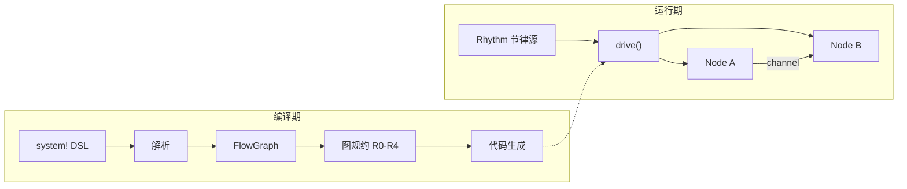

---
hide:
  - navigation
---

# Roplat

<div style="text-align: center; margin: 2em 0;">
<em>编译期安全 · 静态确定调度 · 多语言透明互通</em>
</div>

**Roplat** 是一个面向运行期安全的机器人操作平台。它将 ROS 中常见的运行时崩溃——死锁、类型不匹配、拓扑混乱——**前移到编译期**，让你在 `cargo build` 通过的那一刻就获得对系统行为的信心。

```rust
#[roplat::system]
async fn robot() {
    let mut sensor = SensorNode::new();
    let mut ctrl   = ControllerNode::new();
    let mut motor  = MotorNode::new();

    timer_100hz >> {
        sensor >> ctrl >> motor;
    };
}
```

## 为什么选择 Roplat

<div class="grid cards" markdown>

- :material-shield-check:{ .lg .middle } **编译期安全**

    ---

    类型不匹配、死锁环路、拓扑错误——全部在编译期捕获，而非在实验现场崩溃。

- :material-clock-fast:{ .lg .middle } **零开销确定性**

    ---

    调度图编译期规约为静态代码，节律驱动零堆分配，性能可预测到每个 tick。

- :material-translate:{ .lg .middle } **多语言透明互通**

    ---

    Rust / C++ / Python 节点在同一系统中无缝协作，类型绑定自动生成，无需手写 FFI。

- :material-file-tree:{ .lg .middle } **声明式系统 DSL**

    ---

    用 `>>` 操作符声明数据流，用作用域表达并发边界，代码即拓扑图。

</div>

## 核心架构一览



## 与 ROS 2 的核心差异

| 维度 | Roplat | ROS 2 |
|:-----|:-------|:------|
| **类型检查** | 编译期，泛型约束 | 运行期，MD5 哈希 |
| **调度模型** | 静态确定（图规约） | 动态黑盒（Executor） |
| **死锁检测** | 编译期（通道环路分析） | 无 |
| **内存安全** | Rust 所有权系统保证 | 依赖 C++ 编程纪律 |
| **多语言** | 编译期绑定生成 | 运行时 DDS 序列化 |
| **拓扑表达** | 代码即图（`>>` DSL） | Launch XML / YAML |

## 开始使用

<div class="grid cards" markdown>

- **新手？从这里开始**

    [:octicons-arrow-right-24: 项目介绍](Guide/01 Introduction.md)

- **想快速上手？**

    [:octicons-arrow-right-24: 快速开始](QuickStart/00 快速开始总览.md)

- **想理解设计？**

    [:octicons-arrow-right-24: 核心概念](Concepts/01 Node.md)

</div>
