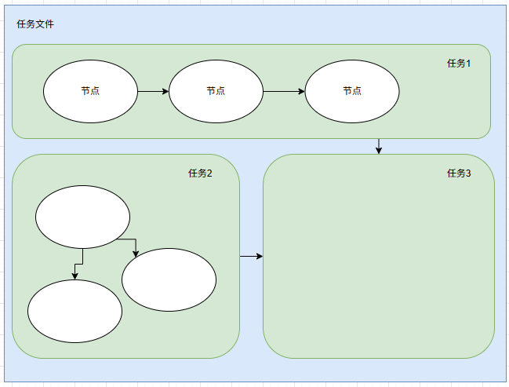
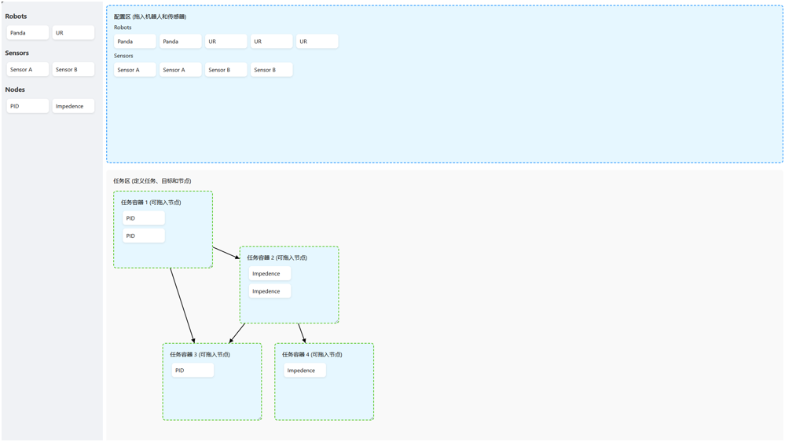
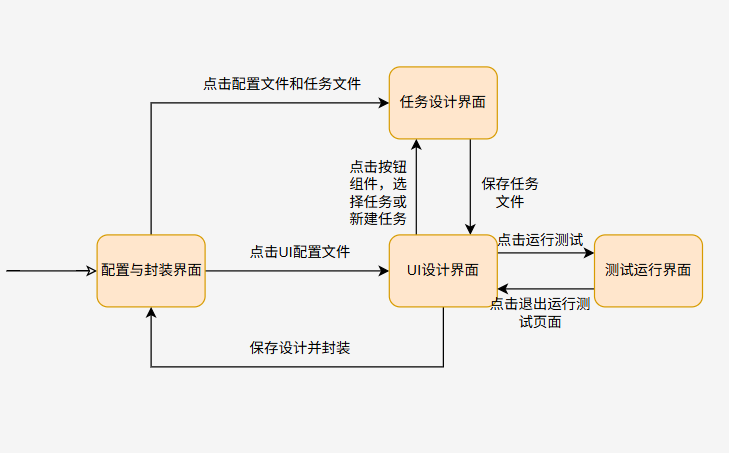

# 需求文档 —— 内核包装

## 需求背景

在实现了机器人系统内核（Roplat）的基础上，为了使得无编程基础的用户能够以较低学习成本地搭建机器人软件，需要实现一个可以用于搭建 UI 的软件生成工具。产品本质由一个可以搭建前端的前端框架和一个可以运行内核的后端组成。

## 相关说明

我们已经实现了机器人系统的内核 `Roplat`，它是一个基于节点化的机器人系统内核，由 `rust` 开发实现，尚且未提交至 `crates.io`,需要克隆 [Roplat内核](https://github.com/Robot-Exp-Platform/Robot-Platform) 运行。

内核运行依赖两个重要的文件，`config.json` 和 `task.json`。其中 `config.json` 用于描述可用的硬件资源，需要在内核运行前提供；而 `task.json` 用于描述任务节点的依赖关系、参数等信息，在内核运行时提供或更新即可（文件样例见附录）。内核运行时会将运行时状态以及相关数据使用 `tracing` 库记录在日志文件中，以供外界调取。

所以前端的核心功能就是容许用户可以搭建自己的 UI 界面，在界面中设计自己的任务节点及其依赖关系，最后将其转换为 `task.json` 文件，在点击触发按钮时对应的 `task.json` 文件会被传递给内核由内核执行。

## 需求概述

整个前端分为四个主要的页面，分别为：配置与封装界面、任务设计界面、UI设计界面、调试运行界面四个部分。在之后分别进行描述。

前端的实现可以使用网页也可以使用 `GUI`，对于用户来说不存在远程访问，所有操作均为本地操作。

### 配置与封装界面

该界面作为整个前端的主界面，也是整个工作流程的开始和结束，当用户第一次进入该界面时，需要输入项目名称和项目路径（可采用默认路径）作为工作区域。工作域下需要一个用于识别的特殊文件，之后的操作均在该工作域中进行。

当然用户也可以选择一个已经存在的工作域，继续之前的工作。

内核需要的一个参考工作文件路径可以为

- 工作域
  - `config.json`：内核需要的配置文件，描述硬件资源
  - `tasks`
    - `task_1.json`
    - `task_2.json`

在完成UI设计后，将其编译封装为一个可执行文件包，用于发布在其他机器上运行。

### 任务设计界面

首先需要描述 **任务** 与 **节点** 的关系。每个任务文件都是多个任务的集合，任务是内核的执行单元，单个任务文件中的任务采用依赖关系组成有向图。任务中存在多个节点，同一个任务中的多个节点同时开始工作，节点之间通过信道进行通讯。



任务设计界面主要用于生成 `config.json` 和 `task.json` 文件。用户可以在界面中配置硬件资源（在内核未启动时）添加、删除、修改任务和节点，设置节点的参数和依赖关系。一个示意的任务设计界面如下：



#### 配置区域

配置区域用于描述可用的外设，用户可以在该区域添加、删除、修改外设。从侧方资源栏中拖拽进入即可。单击已拖入配置区的外设可以为其添加配置，常见的配置有机器人的名称和其基座标。坐标的描述为一个可反序列化的字符串，其对应的 `rust` 类型为 `robot_behavior::Pose`。

```rust
pub enum Pose {
    Euler([f64; 3], [f64; 3]),
    Quat(na::Isometry3<f64>),
    Homo([f64; 16]),
    AxisAngle([f64; 3], [f64; 3], f64),
    Position([f64; 3]),
}
```

#### 任务操作

任务通过唯一 `id` 辨识，任务文件

- 任务新建
  - 从侧边资源栏将节点拖入任务中时在该任务中新增该节点，在拖入空白区域时创建新任务并放入该节点
  - 双击空白任务区在下方或右侧新增节点
- 任务排布与连接
  - 节点新建、拖拽、拉伸时保证边线均在 `20px` 网格上对齐
  - 按住任务可拖动
  - 单击任务后出现箭头跟随鼠标，直到单击下一个任务构成依赖关系
  - 任务较多时任务区可下滑，侧边栏保持悬垂
- 任务删除
  - 长按但不移动时任务时虚化，此时侧方资源栏变为红色垃圾桶，拖入即删除任务

#### 节点操作

节点当且仅当可以从侧方资源栏拖入任务区创建

- 节点配置
  - 单击节点出现配置右侧节点配置栏
  - 添加外设：从配置区拖拽外设进入节点配置栏
  - 添加参数：每个节点有独特的参数类型（暂时可以偷懒直接给出整个 `json` 串代表的节点参数）
  - 节点删除：节点配置栏最下方红色按钮删除
- `target` 节点
  - `target` 节点是每个任务的固有节点，对应文件中的 `target` 字段，其配置栏只接受一段 `json` 字符串

#### 任务文件操作

从目录中找到可读取的 `**.json` 文件与将当前界面中的任务保存为文件。

### UI设计界面

UI 设计界面主要用于设计UI界面，说白了就是给有限的块让用户拖拽搭积木，需要的积木简述如下

- 文字（可修改字号，颜色）
- 图片（可修改颜色，大小）
- 矩形、圆形等几何图形（可修改颜色，大小，形状）
- 按钮（其中包含一个 `**.json` 任务文件参数，功能为单击时将该文件发给内核）
- 流式视频窗口（可打开电脑相机并播放画面）
- 其他软件的GUI展示（如正在运行的 `pybullet` 仿真器展示在前端中，该效果和上一个组件的效果都类似于OBS的视频源和屏幕共享）
- 内核运行过程中的监控数据展示窗口（类似InfluxDB的图表展示，用于展示当前进展和节点参数）

### 调试运行界面

去除 UI 设计界面的工具要素，以设计的界面运行。点击角落的按钮实现 **运行** 、 **退出调试运行界面** 、 **重启**

### 各页面的跳转关系



## 附录

### 配置文件样例

```json
{
  "robots": [
    { "name": "panda_1", "robot_type": "panda", "base_pose": { "rotation": [1.0, 0.0, 0.0, 0.0], "translation": [0.0, 0.0, 0.0] } },
    { "name": "panda_2", "robot_type": "panda", "base_pose": { "rotation": [1.0, 0.0, 0.0, 0.0], "translation": [0.0, 1.0, 0.0] } }
  ],
  "sensors": [
    {
      "name": "obstacle_list_1",
      "sensor_type": "obstacle_list",
      "params": [{ "Sphere": { "id": 1, "pose": { "rotation": [1, 0, 0, 0], "translation": [0, 0, 0] }, "params": 0.1 } }]
    }
  ]
}
```

```json
[
  {
    "id": 0,
    "rely": [],
    "target": [],
    "nodes": [["bullet", ["panda_1", "panda_2"], ["obstacle_list_1"], { "period": 0.0, "config_path": "./config/config.json" }]],
    "edges": [[1, 0]]
  },
  {
    "id": 1,
    "rely": [],
    "target": [
      { "Transform": [1, { "rotation": [1, 0, 0, 0], "translation": [-1, 2, 1] }, { "rotation": [1, 0, 0, 0], "translation": [0.5, 1, 0.5] }] }
    ],
    "nodes": [["obstacle_releaser", [], ["obstacle_list_1"], { "period": 0.1, "interp": 10 }]],
    "edges": [[0, 1]]
  },
  {
    "id": 3,
    "rely": [0],
    "target": [
      { "Joint": [[0.0124, -0.8838, 0.3749, -2.2172, 0.232, 1.7924, 1.3719], 7, null] },
      { "Joint": [[0.2896, -1.0286, 0.6738, -2.0833, 0.551, 2.1874, 1.0705], 7, null] },
      { "Joint": [[0.0592, -0.3941, 0.4692, -1.6001, 0.1456, 2.0968, 1.201], 7, null] },
      { "Joint": [[0.1, -0.8292, 0.7548, -2.3791, 0.1615, 2.2308, 1.4292], 7, null] },
    ],
    "nodes": [
      ["cfs", ["panda_2"], ["obstacle_list_1"], { "period": 0.95, "ninterp": 7, "niter": 10, "cost_weight": [0, 10.0, 20.0], "solver": "osqp" }],
      ["interp", ["panda_2"], ["obstacle_list_1"], { "period": 0.1, "interp_fn": "lerp", "ninter": 25 }],
      ["position", ["panda_2"], [], { "period": 0.004 }]
    ],
    "edges": [
      [0, 1],
      [1, 2],
      [2, 3],
      [3, 0]
    ]
  }
]
```
