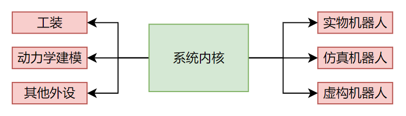

# 外设篇 - 概述

在机器人操作系统中，外设指一切可以输入指令并返回状态的东西。如具体的机器人、执行机构、传感器等，也可以是虚拟的如各种形式的仿真器、示波器、动力学建模等，更进一步地，还可以是其他语言的程序甚至其他设备上的机器人操作系统。

真实的机器人固然可爱，但是受限于系统、成本、安全性等问题，我们往往需要将指令发送到仿真器中或者动力学建模中去，从而我们可以快捷、安全地验证和实现我们的想法。

(外设是这样的，机器人和仿真器只需要做好反馈就好了，系统内核要考虑的就多了.jpg)

  

而对于系统内核来说，外设的类型应当是黑盒，给具体的机器人还是仿真器的指令都应该是相同且一致的，于是我们需要构造的外设需要具备相同的行为接口，或者我们称之为——机器人总线。这太美妙了，不是吗？

  

在本篇中，我们需要实现机器人总线，以及一些具体的外设，如机器人、仿真器、动力学建模等。