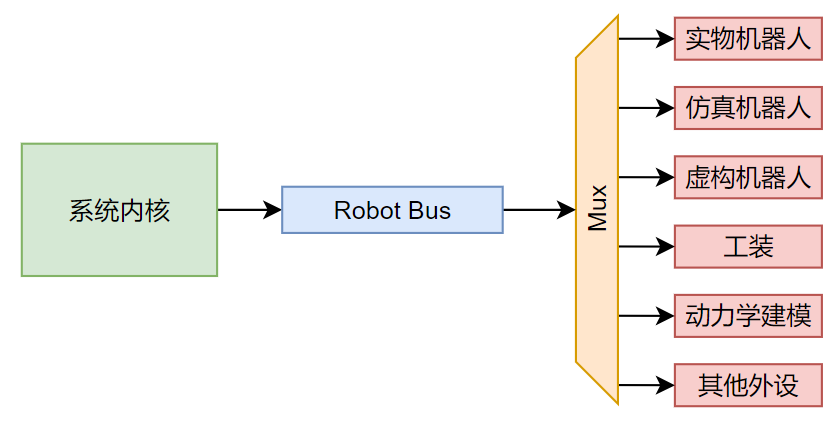

# 外设篇 - 总线

  

总线实际上可以被理解为一个相互保证协议，通过总线的信息都应当有相同的格式。对机器人的各种底层功能和行为进行统一的封装与整理，通过标准化的接口和模块化的设计，屏蔽底层硬件或协议的差异。开发者只需专注于调用统一的API，即可完成大部分常见的机器人控制与数据获取操作，从而降低开发和维护成本。

在机器人操作系统中，总线实际上还多了一层额外的含义，总线将作为一种安全性的把关，具体阐述为：

1. 向外设许诺一定提供**合法的**、**安全的**指令
2. 向内核提供一定**及时**反馈的外设

必须要说明的一点是厂商提供的指令集中有大量无用的指令，也有大量无法保证安全的指令。不安全的指令通常会导致外设的不安全行为，轻则导致外设的损坏，重则导致外设周围的人员损坏。

**简单来说，总线需要对指令进行审查和过滤，同时监控外设状态，及时发现外设的异常行为。**

有时，我们希望发送指令时仿真器能和真实机器人一样收到指令，但是只使用真实机器人返回的状态，这就是总线发力的时候了。

## 优势

* 硬件无关性：通过抽象和封装，不同型号的电机、传感器、通信接口（CAN、UART、SPI等）都能以统一的方式对外提供服务。更换或增加底层硬件时，秩序修改适配层驱动，而不会影响上层逻辑。
* 模块化设计：将不同功能（运动控制、传感器读写、错误处理等）拆分为独立模块，灵活组合。易于维护和扩展：如果需要添加新功能或升级某一模块，只需在对应模块中实现即可。
* 统一的数据结构与协议：传感器数据、控制指令、状态信息等使用统一的数据格式，让上层逻辑只关心“做什么”，不关心“怎么做”。
* 可移植性与跨平台：驱动层对底层实现细节进行了封装，可在多种操作系统或硬件平台上部署（如 Linux、RTOS 等）。
* 提供日志接口及可视化调试工具，快速定位并解决问题。

## 总线架构
