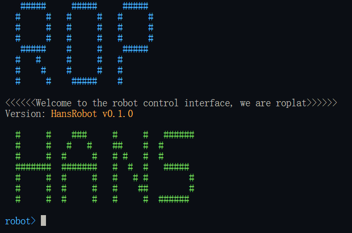

# 外设 - 驱动 - Hans

> 测试用机器人采用 S30

大族机器人驱动是经典的复杂指令驱动，其中包含了诸多功能。驱动的开发人员似乎不是同一人并且没有提前约定好接口规范，导致驱动的接口风格并不是很统一，公司提供的样例也并非全面，这给使用带来了一些困难。

出于统一化驱动接口及通用机器人驱动的实例化，我们完全重构了 HANS 机器人的驱动，使其接口风格与其他驱动保持一致。

本库是[通用机器人驱动计划](https://github.com/Robot-Exp-Platform/robot_behavior)中的一员！我们立志于为更多的机器人平台提供 Rust 语言的驱动支持！**统一不同型号的机器人驱动接口，降低机器人学习成本，提供更高效的机器人控制方案！**

## Interface

### server(驱动服务器)

出于被其他服务调用的需求，我们提供一个可执行文件，用于接受 `tcp` 指令并驱动机器人执行

#### 使用方法

最新的下载地址为 [libhans_server](https://github.com/Robot-Exp-Platform/libhans-rs/releases)

下载完成后将得到一个 `libhans.exe` 文件，在当前文件目录命令行中运行 `libhans.exe ${PORT}` 即可启动驱动服务器，其中 `${PORT}` 为服务器监听端口号，其他服务访问时应使用 `tcp` 连接该端口。(注意 `${PORT}` 并非机器人本身的ip和端口号，自行定义即可)

当驱动多台大族机器人时，应当首先使用示教器右上角三横线按钮，找到 `ip` 并将**多台机器人和驱动服务器所在电脑均设置至同一网段**，设置完成后先尝试 `ping` 机器人 `ip` 是否可达，若可达则可以使用驱动服务器进行控制。多台机器人的控制需要使用多个驱动服务器，使用命令行多开并监听不同端口即可。

#### 指令类型

所有指令均采用 `json` 格式，具体的指令与对应的通讯内容如下：

- Connect | 发送 `{"Connect":{"ip":"192.168.0.2"}}` | 返回

> 注意：`ip` 为机器人的 `ip` 地址，**本指令应当在其他所有指令前执行，否则服务器将无法连接到机器人**

- Enable | 发送 `"Enable"` | 返回

> 注意：`Enable` 指令会使能机器人，**请确保机器人处于安全状态**,当机器人报错时可以通过使能机器人来重置错误状态

- Disable | 发送 `"Disable"` | 返回
- Reset | 发送 `"Reset"` | 返回
- IsMoving | 发送 `"IsMoving"` | 返回 `true`

> 注意：`IsMoving` 指令会返回机器人是否正在运动，返回值为 `true` 或 `false`

- Stop | 发送 `"Stop"` | 返回
- Pause | 发送 `"Pause"` | 返回
- Resume | 发送 `"Resume"` | 返回
- ArmState | 发送 `"ArmState"` | 返回 `ArmState { joint: Some([0.0, 0.0, 0.0, 0.0, 0.0, 0.0]), joint_vel: Some([0.0, 0.0, 0.0, 0.0, 0.0, 0.0]), joint_acc: Some([0.0, 0.0, 0.0, 0.0, 0.0, 0.0]), tau: Some([0.0, 0.0, 0.0, 0.0, 0.0, 0.0]), pose_o_to_ee: Some(Euler([0,0,0,0,0,0])), pose_f_to_ee: Some(Euler([0,0,0,0,0,0])), pose_ee_to_k: Some(Euler([0,0,0,0,0,0])), cartesian_vel: Some([0.0, 0.0, 0.0, 0.0, 0.0, 0.0]), load: Some(LoadState { m: 0.0, x: [0.0, 0.0, 0.0], i: [0.0, 0.0, 0.0, 0.0, 0.0, 0.0, 0.0, 0.0, 0.0] }) }`

> 注意：`ArmState` 指令会返回机器人的状态信息，返回值为 `ArmState` 结构体，包含了机器人的关节角度、关节速度、关节加速度、关节电流、末端执行器的位姿、末端执行器的速度等信息, 大族机器人并不包含其中所有的字段，不包含的字段会将 Some(...) 替换为 None

- SetLoad | 发送 `{"SetLoad":{"m":1.0,"x":[0.0,0.0,0.0]}}` | 返回

> 注意：`SetLoad` 指令会设置机器人的负载，返回值为 `true` 或 `false`

- SetSpeed | 发送 `{"SetSpeed":{"speed":1.0}}` | 返回

> 注意：`SetSpeed` 指令会设置机器人的速度，大小范围为 `[0.0, 1.0]`

- MoveJoint | 发送 `{"MoveJoint":{"joint":[0.0,0.0,0.0,0.0,0.0,0.0],"speed":1.0}}` | 返回

> 关节运动指令，`joint` 为关节角度，单位为 **角度**, `speed` 为速度

- MoveJointRel | 发送 `{"MoveJointRel":{"joint":[1.0,0.0,0.0,0.0,0.0,0.0]}}` | 返回

> 关节相对运动指令，`joint` 为关节角度，单位为 **角度**, 指令中请确保只有一个数不为0，其他指令将被忽略

- MoveLinearWithEuler | 发送 `{"MoveLinearWithEuler":{"pose":[0.0,0.0,0.0,0.0,0.0,0.0],"speed":1.0}}` | 返回

> 笛卡尔坐标系运动指令，`pose` 为末端执行器的位姿，单位为 **mm**，`speed` 为速度

- MoveLinearWithEulerRel | 发送 `{"MoveLinearWithEulerRel":{"pose":[1.0,0.0,0.0,0.0,0.0,0.0],"speed":1.0}}` | 返回

> 笛卡尔坐标系相对运动指令，`pose` 为末端执行器的位姿，单位为 **mm**，指令中请确保只有一个数不为0，其他指令将被忽略

- MovePathFromFile | 发送 `{"MovePathFromFile":{"path":"low_traj.json","speed":1.0}}` | 返回

> 路径运动指令，`path` 为路径文件名，`speed` 为速度, 运行时将会读取当前目录下的 `low_traj.json` 文件，文件格式如下

```json
[
  { "Joint": [0.0, 0.0, 0.0, 0.0, 0.0, 0.0] },
  { "Joint": [0.0, 0.0, 0.0, 0.0, 0.0, 0.0] },
  { "Joint": [0.0, 0.0, 0.0, 0.0, 0.0, 0.0] },
  { "Joint": [0.0, 0.0, 0.0, 0.0, 0.0, 0.0] },
  { "Joint": [0.0, 0.0, 0.0, 0.0, 0.0, 0.0] },
  { "Joint": [0.0, 0.0, 0.0, 0.0, 0.0, 0.0] },
  { "Joint": [0.0, 0.0, 0.0, 0.0, 0.0, 0.0] },
  { "Joint": [0.0, 0.0, 0.0, 0.0, 0.0, 0.0] },
  { "Joint": [0.0, 0.0, 0.0, 0.0, 0.0, 0.0] },
  { "Joint": [0.0, 0.0, 0.0, 0.0, 0.0, 0.0] }
]
```

### CLI(Command Line Interface ,命令行接口)

命令行是既方便调试又方便集成的接口形式，我们提供了一个命令行工具，可以通过命令行来控制机器人。

=== "Win"
    双击 `libhans.exe` 即可打开命令行工具, 也可以使用命令行或者 `PowerShell` 打开 `libhans.exe`
=== "Linux"
    在终端中打开对应目录, 输入 `./libhans` 即可打开命令行工具

运行命令行工具之后会首先输出组织名称、驱动名称、版本号。一个样例如下



此后在命令行中输入 `help` 可以查看所有可用的命令

具体的，有以下命令：

- `connect -i {IP} -p {PORT}` 连接到机器人
- `disconnect` 断开与机器人的连接
- `enable` 使能机器人
- `disable` 去使能机器人
- `robot-impl` 进入原始指令模式
- `move -j {JOINTS}` 以关节角度方式移动机器人
- `move -r -j {JOINTS}` 以关节角度方式相对移动机器人
- `move -l {POSE}` 以笛卡尔坐标系（欧拉角）移动机器人
- `move -r -l {POSE}` 以笛卡尔坐标系（欧拉角）相对移动机器人
- `set_speed {SPEED}` 设置运动速度
- `key-board-control` 进入键盘控制模式
- `version` 获取机器人版本信息
- `exit` 退出命令行工具

如果想要点动操作，就要进入键盘控制模式, 请注意，进入键盘控制模式后，第一次应该输入一个小于 1 的浮点数，这个数会作为速度

进入键盘控制模式之后。沿着键盘位置 `1~6` 表示正向增加关节角 `q~y` 表示负向增加关节角, `a~h` 表示空间正向运动，`z~m` 表示空间负向运动，效果同示教器。

### GUI(Graphical User Interface ,图形用户界面)

## 对象和方法

我们在驱动中封装了大族机器人的所有指令，但是单纯的指令方法并不对外暴漏，对外暴漏的方法为符合 [Robot Arm Behavior](../02%20instruct.md) 的方法。如果一定要使用原始指令，可以使用对象下的 `robot_impl` 属性下的子方法，此时输入和输出被强行约束为指令格式。

## 指令

大族机器人的原生指令主要分为以下几类：

- 初始化指令
- 轴组控制指令
- 脚本控制指令
- 电箱控制指令
- 状态读取与设置指令
- 位置、速度、电流读取指令
- 坐标转换计算指令
- 工具坐标与用户坐标读取指令
- 力控控制指令
- 通用运动类控制指令
- 连续轨迹运动类控制指令
- Servo 运动类控制指令
- 相对跟踪运动类控制指令
- 其他指令

具体的指令格式和通讯方法请参考大族机器人提供的文档。
